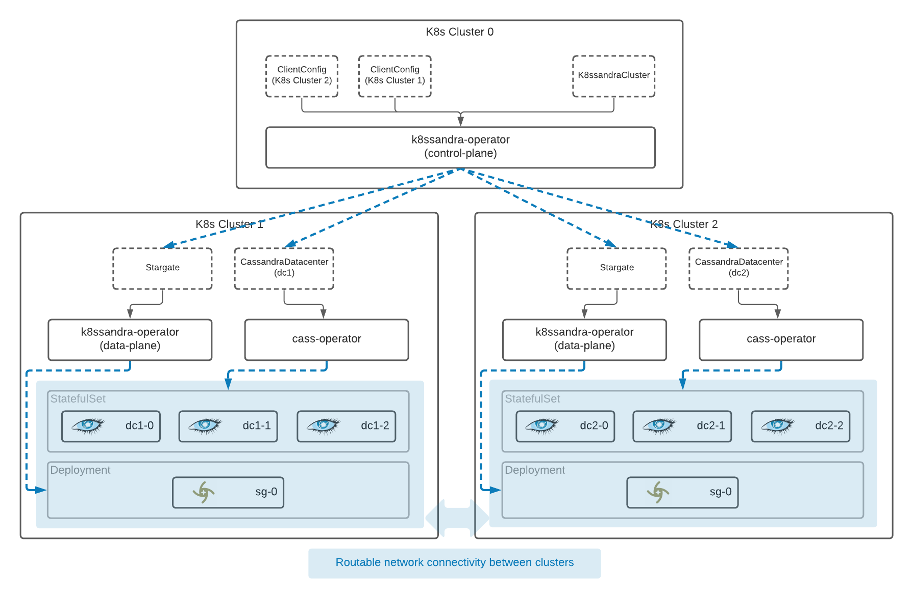

# K8ssandra Operator

**[Documentation site](https://docs.k8ssandra.io/)**

This is the Kubernetes operator for K8ssandra.

K8ssandra is a Kubernetes-based distribution of Apache Cassandra that includes several tools and components that automate and simplify configuring, managing, and operating a Cassandra cluster.

K8ssandra includes the following components:

* [Cassandra](https://cassandra.apache.org/)
* [Stargate](https://stargate.io/)
* [Medusa](https://github.com/thelastpickle/cassandra-medusa)
* [Reaper](http://cassandra-reaper.io/)
* [Grafana](https://grafana.com/)
* [Prometheus](https://prometheus.io/)

K8ssandra 1.x is configured, packaged, and deployed via Helm charts. Those Helm charts can be found in the [k8ssandra](https://github.com/k8ssandra/k8ssandra) repo.

K8ssandra 2.x will be based on this operator.

One of the primary features of this operator is multi-cluster support which will facilitate multi-region Cassandra clusters.

## Architecture
The K8ssandra operator is being developed with multi-cluster support first and foremost in mind. It can be used seamlessly in single-cluster deployments as well.

K8ssandra Operator consists of a control plane and a data plane.
The control plane creates and manages object that exist only in the API server. The control plane does not deploy or manage pods. 

**Note:** The control plane can be installed in only one cluster, i.e., the control plane cluster. 

The data plane can be installed on any number of clusters. The control plane cluster can also function as the data plane.

The data plane deploys and manages pods. Moreover, the data plane may interact directly with the managed applications. For example, the operator calls the management-api to create keyspaces in Cassandra.

### Diagram

In this diagram you can see a small example of a multi-cluster deployment.

### Requirements
It is required to have routable pod IPs between Kubernetes clusters; however this requirement may be relaxed in the future.

If you are running in a cloud provider, you can get routable IPs by installing the Kubernetes clusters in the same VPC.

If you run multiple kind clusters locally, you will have routable pod IPs assuming that they run on the same Docker network which is normally the case. We leverage this for our multi-cluster E2E tests.

<!--
This section needs to be moved elsewhere, probably a dedicated page of its own.

## Connecting to remote clusters
The control plane needs to establish client connections to remote cluster where the data plane runs. Credentials are provided via a [kubeconfig](https://kubernetes.io/docs/tasks/access-application-cluster/configure-access-multiple-clusters/) file that is stored in a Secret. That secret is then referenced via a `ClientConfig` custom resource.

A kubeconfig entry for a cluster hosted by a cloud provider with include an auth token for authenticated with the cloud provider. That token expires. If you use one of these kubeconfigs be aware that the operator will not be able to access the remote cluster once that token expires. For this reason it is recommended that you use the [create-clientconfig.sh](https://github.com/k8ssandra/k8ssandra-operator/blob/main/scripts/create-clientconfig.sh) script for configuring a connection to the remote cluster. This script is discussed in more detail in a later section.
-->

## Installing the operator
See the install [guide](https://docs.k8ssandra.io/install/).

## Contributing
For more info on getting involved with K8ssandra, please check out the [k8ssandra community](https://k8ssandra.io/community/) page.

The remainder of this section focuses on development of the operator itself.

## Community
Check out the full K8ssandra docs at [k8ssandra.io](https://k8ssandra.io/).

Start or join a forum discussion at [forum.k8ssandra.io](https://forum.k8ssandra.io/).

Join us on Discord [here](https://discord.gg/YewpWTYP0).

For anything specific to K8ssandra 1.x, please create the issue in the [k8ssandra](https://github.com/k8ssandra/k8ssandra) repo. 

## Development
See the development [guide](docs/development/README.md).

